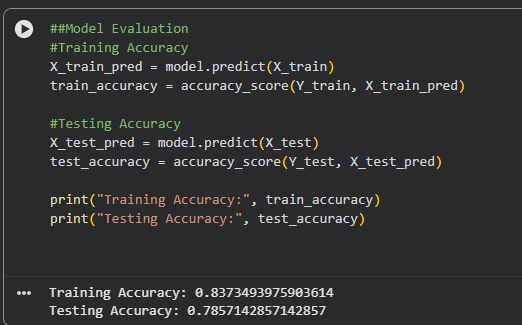

🪨 Sonar Rock vs Mine Classification
Machine Learning project using Logistic Regression

📌 Project Overview
This project focuses on building a binary classification model to predict whether an object detected by sonar signals is a Rock (R) or a Mine (M).
The model is built using Logistic Regression, a simple yet effective algorithm for binary classification problems.

📊 Dataset Information
Source: Kaggle – Sonar Dataset
Dataset link: https://www.kaggle.com/datasets/mayurdalvi/sonar-mine-dataset
Samples: 208
Features: 60 continuous numerical features
Target Classes:
R → Rock
M → Mine
The dataset is approximately balanced, so no class imbalance techniques (SMOTE, class weighting, etc.) were required.

⚙️ Technologies Used
Python
NumPy
Pandas
Scikit-learn
Google Colab

📁 Project Structure
sonar-rock-vs-mine/
│
├── images/
│   └── accuracy.png
├── README.md
├── sonar_prediction.ipynb
└── .gitignore

🧠 Model Workflow
1- Load dataset using Kaggle API
2-Perform data inspection and preprocessing
3-Split dataset into training and testing sets
4-Train Logistic Regression model
5-Evaluate model performance
6-Predict class for new unseen input

📈 Model Evaluation
Since the dataset is balanced, accuracy was only used as an evaluation metric

The model performance was evaluated using accuracy on both training and testing data.
**Results:**
- Training Accuracy: 83.74%
- Testing Accuracy: 78.57%
The close gap between training and testing accuracy indicates that the model generalizes well and does not suffer from significant overfitting.
## Model Accuracy

🎯 Key Learning Outcomes
End-to-end ML workflow implementation
Understanding classification problems
Practical use of Logistic Regression
Model evaluation and interpretation

🚀 Future Improvements
Try advanced models (SVM, Random Forest)
Add cross-validation
Deploy as a web app using Streamlit

👨‍💻 Author
Jay Patel
Aspiring Machine Learning Engineer
